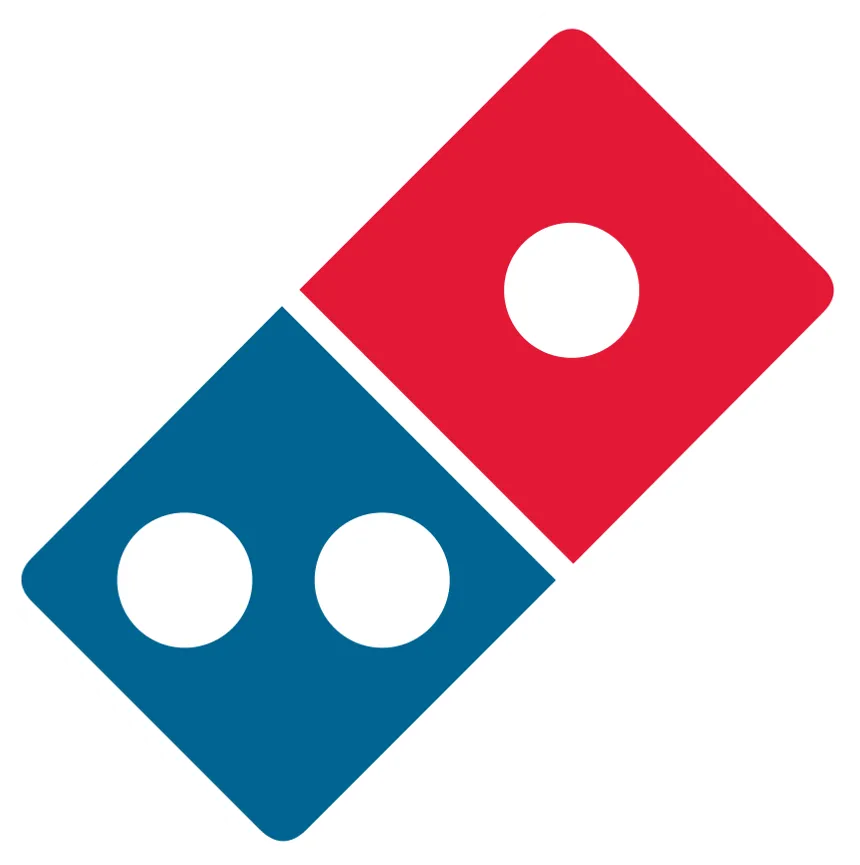
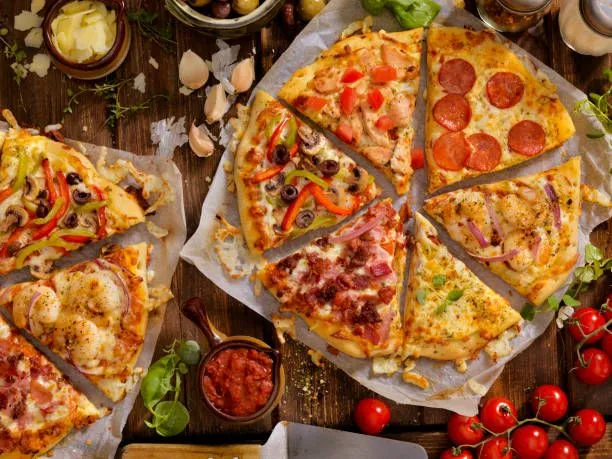
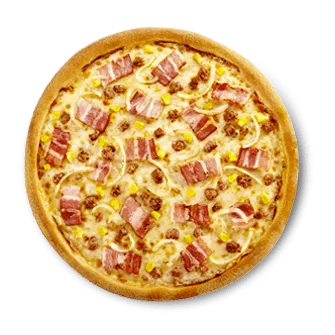
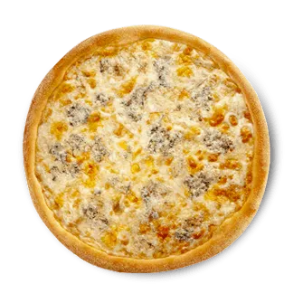
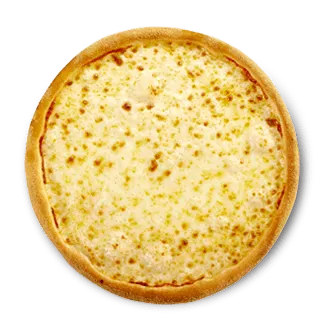
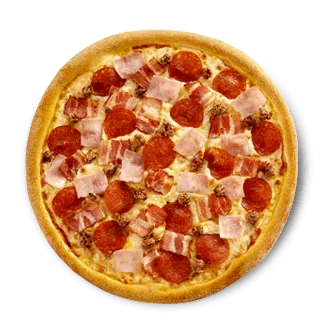
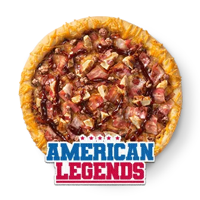
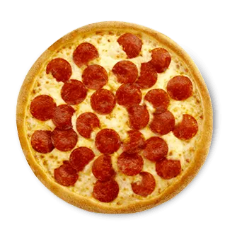

# DominosPizza 

## Pizzas

- 
- 
- 
- 
- 
- 

## Descripción del Proyecto  
Este proyecto está desarrollado con **React** como framework principal y hace uso de las siguientes tecnologías:  
- **Bootstrap**  
- **Bootstrap Icons**  
- **React-Bootstrap**  

---
## Si Quieres lanzar el server escribe en la terminal

`npm run dev`

si no te funciona asegurate de tener instalado los packetes 
debe aparecer una carpeta llamada **node_modules** si no aparece
ejecuta esto en la terminal

`npm install`

---  

## Tareas de Blessing  
- ⭐ FirstHeading  
- ⭐ Services  
- ⭐ Footer  

---  

## Tareas de Dann  
- ⭐ Navbar  
- ⭐ Tagline  
- ⭐ Contact 